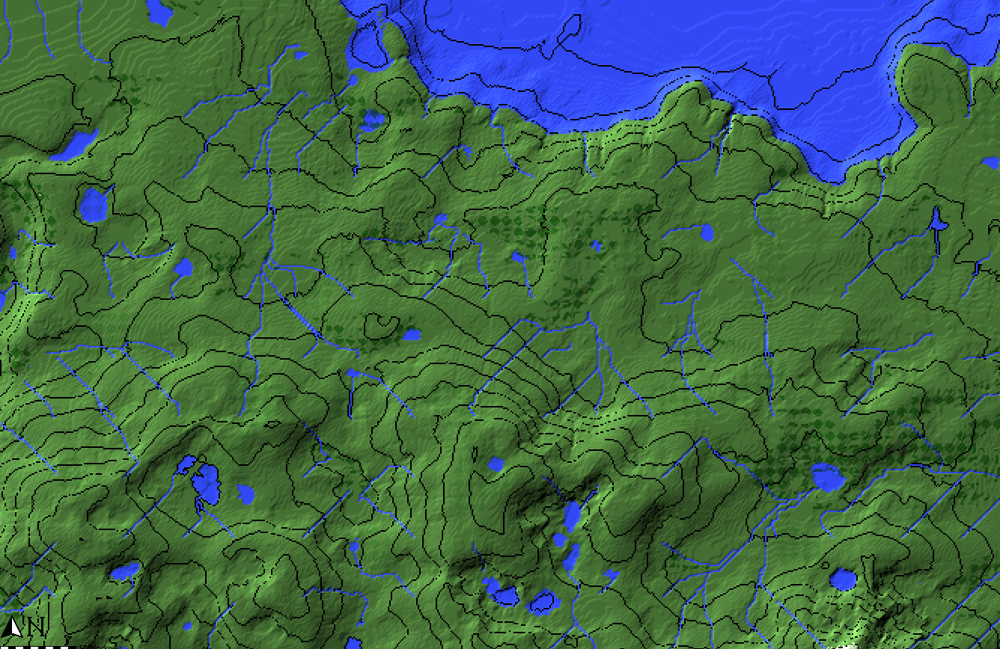
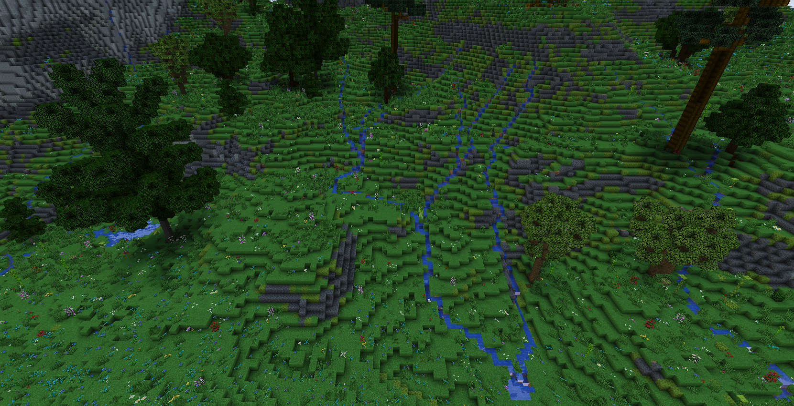

# The Puddler

Worldpainter script that creates small rivers and ponds across the map

downloads: https://github.com/IR0NSIGHT/Puddler/releases  
github: https://github.com/IR0NSIGHT/Puddler

(image by Dannypan from the worldpainter discord)

# How to use

1. download the [newest release](https://github.com/IR0NSIGHT/Puddler/releases) as a zip file puddler.js file 
2. unpack the zip folder somewhere
3. mark all the spots where rivers can start in your worldpainter world with the CYAN annotation layer.
4. in WorldPainter, on the top toolbar, center-right, open "run script" and select Puddler.js from the folder where you unpacked the zip file
5. Select your wanted parameters and run the script. You can leave the default values to get a quick run with rivers and puddles.

MIT LICENSED
