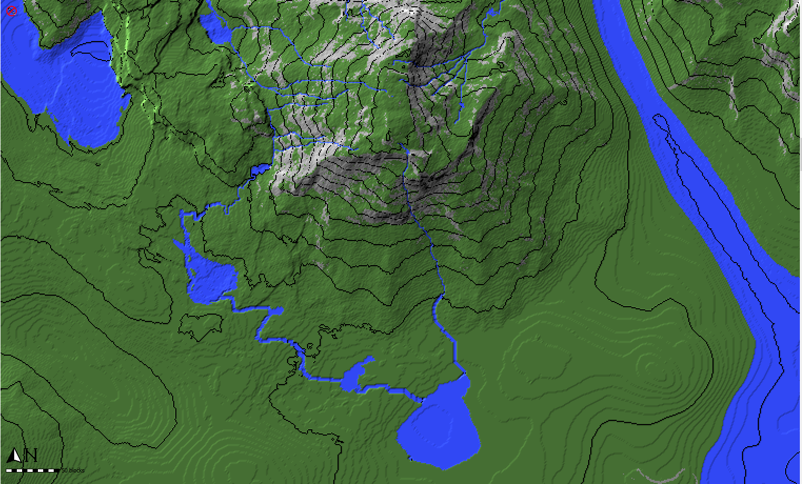
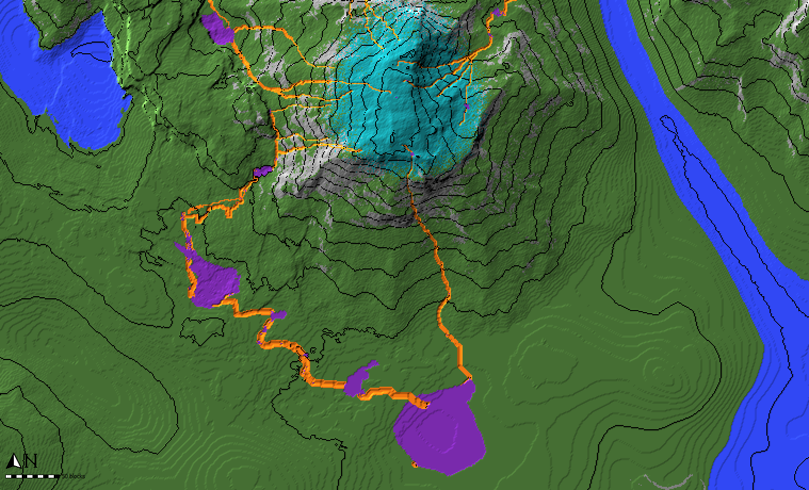
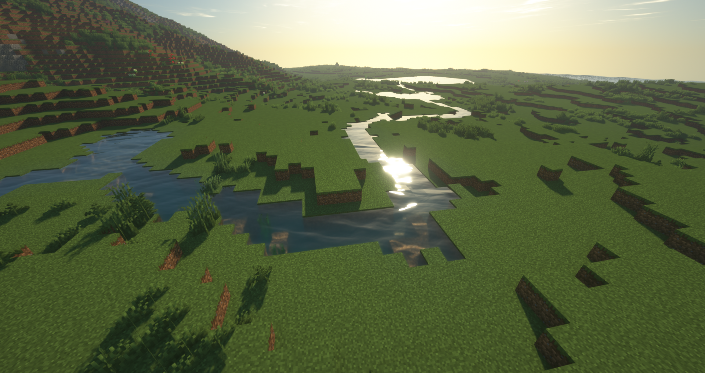

Worldpainter script that creates small rivers and ponds across the map

downloads: https://github.com/IR0NSIGHT/Puddler/releases  
github: https://github.com/IR0NSIGHT/Puddler

|               1                |                  1                  |
|:------------------------------:|:-----------------------------------:|
|  |  |
|           |               |

# Instructions

1. download the [newest release](https://github.com/IR0NSIGHT/Puddler/releases) as a zip file puddler.js file 
2. unpack the zip folder somewhere
3. mark all the spots where rivers can start in your worldpainter world with the CYAN annotation layer. Be generous, a 100x100 area is fine
4. in WorldPainter, on the top toolbar, center-right, open "run script" and select Puddler.js from the folder where you unpacked the zip file
5. Select your wanted parameters and run the script. Check "use Annotations" to get a preview of the rivers.
6. Inspect if you like the rivers and puddles (lakes)
7. Undo the script with ctrl + z
8. Edit the terrain, to control where the water flows and where lakes form
9. Repeat steps 5-8 until you are satisfied
10. Run the script a final time with "flood Puddles" and "apply Rivers" checked to apply water
11. Export the map to minecraft

## Example Video
https://youtu.be/kUJXZ7FjP7Y

## Parameters
- Max Puddle Surface: Lakes will stop growing if they reach this surface area and will not overflow and spawn new rivers.
    Smaller value: smaller lakes, rivers might not reach ocean
- Minimal River Length: Dont apply rivers that are shorter than this
- Spawn Probability: Chance for a river to spawn at a cyan annotated block.
  - 1000 = 1 block for 1000 cyan blocks will spawn a river. 
  - 1 = 1 block for 1 cyan block will spawn a river
- Flood Puddles: Puddles (Lakes) will be filled with water
- Apply Rivers: Rivers will be filled with water
- Apply as Annotations: Rivers and Puddles will be annotated in Orange and Purple
- Ocean Water Leve: Rivers will stop once they reach this height. Should match your ocean level.
